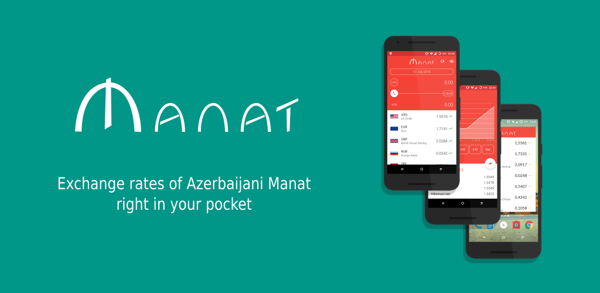
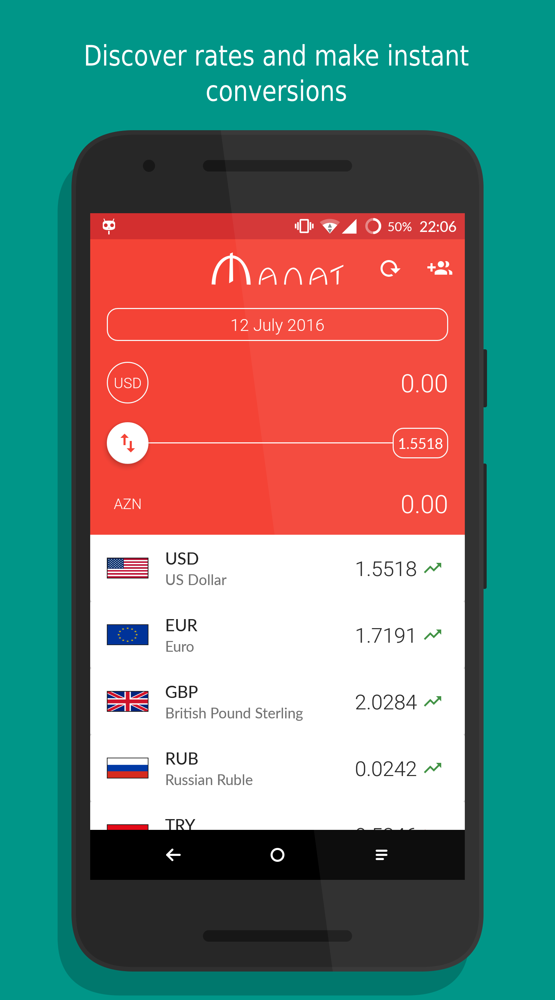
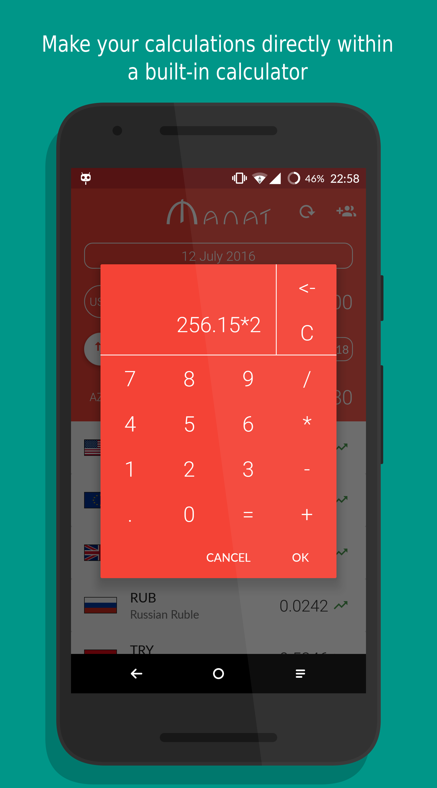
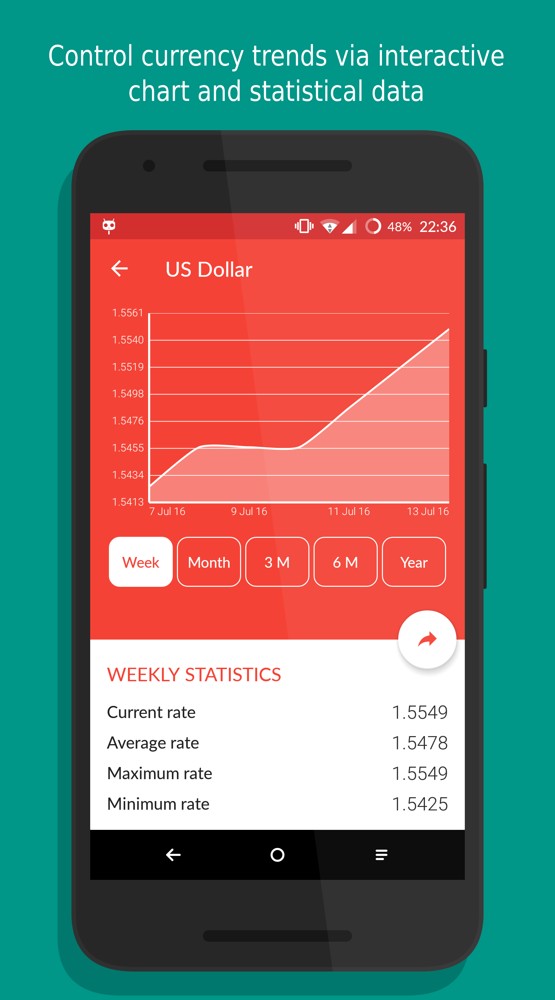
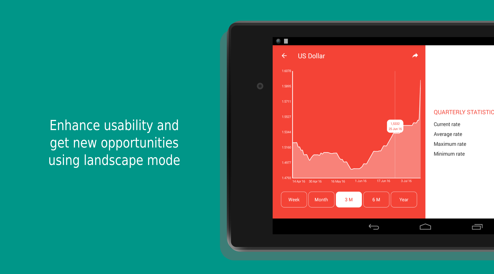

# Manat
Manat is an easy to use and free app, which shows daily exchange rates of foreign currencies relatively to Azerbaijani manat (AZN). Manat allows users to convert AZN into other currencies and vice versa. It was developed by me as a Capstone Project of Android Nanodegree Program.

[Download Manat from Google Play Market](https://play.google.com/store/apps/details?id=org.ogasimli.manat)

## Features

The main features of the app:
* Live and historical exchange rates of more than 45 currencies provided by the Central Bank of Azerbaijan (CBAR)
* User friendly interface designed based on Material Design principles
* Built in calculator
* Live graphs to illustrate rate trends
* Currency widget to view all rates at a glance
* Ability to share exchange rates with friends or partners

## Exchange Rates API

Manat uses official daily exchange rates published by the CBAR. However, since the public API of CBAR does not allow to retrieve exchange rates for more than one particular date at once, Manat retrieves the data from a NoSQL database created and maintained by me specifically for this application. The values in database are kept automatically up to date with the help of a special backend application.

## Screenshots

## Libraries Used

* [ButterKnife](https://github.com/JakeWharton/butterknife)
* [Retrofit](https://github.com/square/retrofit)
* [ProviGen](https://github.com/TimotheeJeannin/ProviGen)
* [MPAndroidChart](https://github.com/PhilJay/MPAndroidChart)
* [Joda Time](https://github.com/JodaOrg/joda-time)
* [Transitions-Everywhere](https://github.com/andkulikov/Transitions-Everywhere)
* [EvalEx](https://github.com/uklimaschewski/EvalEx)
* [Calligraphy](https://github.com/chrisjenx/Calligraphy)

## Android Developer Nanodegree
[![udacity][1]][2]

[1]: Manat/screenshots/nanodegree.png
[2]: https://www.udacity.com/course/android-developer-nanodegree--nd801

## License

    Copyright 2015 Orkhan Gasimli

    Licensed under the Apache License, Version 2.0 (the "License");
    you may not use this file except in compliance with the License.
    You may obtain a copy of the License at

        http://www.apache.org/licenses/LICENSE-2.0

    Unless required by applicable law or agreed to in writing, software
    distributed under the License is distributed on an "AS IS" BASIS,
    WITHOUT WARRANTIES OR CONDITIONS OF ANY KIND, either express or implied.
    See the License for the specific language governing permissions and
    limitations under the License.
